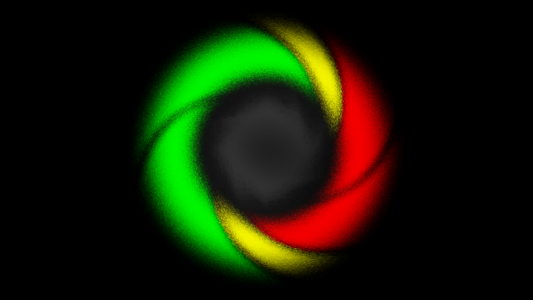

# Introduction
My name is Denis and I am a .Net and Unity programmer.

# Unity Projects
## Clean Game Example (Unity)
This is example of a Unity shooter game project with advanced architecture (inspired by Clean Architecture, Domain-Driven Design and State-Driven UI).
- [GitHub](https://github.com/denis535/CleanGameExample)
- [YouTube](https://youtu.be/WmLJHRg0EI4)
- [Habr](https://habr.com/ru/articles/833532/)

## Clean Architecture Game Framework (Unity)
This package provides you with the architecture game framework that helping you to develop your project following the best practices (like Domain Driven Design, Clean Architecture and Uber Ribs).
- [GitHub](https://github.com/Denis535/CleanArchitectureGameFramework/)
- [Unity Package Registry](https://openupm.com/packages/com.denis535.clean-architecture-game-framework/)
- [YouTube](https://youtu.be/JQobAqfakJQ)

## Addressables Extensions (Unity)
This package is addition to Addressables giving you the ability to manage your assets in more convenient way.
- [GitHub](https://github.com/Denis535/CleanArchitectureGameFramework/)
- [Unity Package Registry](https://openupm.com/packages/com.denis535.addressables-extensions/)

## Addressables Source Generator (Unity)
This package is addition to Addressables giving you the ability to reference assets in a very convenient way.
- [GitHub](https://github.com/Denis535/CleanArchitectureGameFramework/)
- [Unity Package Registry](https://openupm.com/packages/com.denis535.addressables-source-generator/)

## Colorful Project Window (Unity)
This package makes the project window much more convenient. This highlights the special folders (modules, assets, resources and sources) in different colors, thus making the project window easier to use.
- [GitHub](https://github.com/Denis535/CleanArchitectureGameFramework/)
- [Unity Package Registry](https://openupm.com/packages/com.denis535.colorful-project-window/)

## UIToolkit Theme Style Sheet (Unity)
This package provides you with the beautiful UIToolkit theme style sheets and some additions and tools.
- [GitHub](https://github.com/Denis535/UIToolkitThemeStyleSheet)
- [Unity Asset Store](https://assetstore.unity.com/packages/tools/gui/uitoolkit-theme-style-sheet-273463)

# .Net Projects
## StateMachine.Pro (.Net)
The library for implementation of stateful object.
- [NuGet](https://www.nuget.org/packages/StateMachine.Pro)

## HierarchicalTreeMachine (.Net)
The library for implementation of advanced hierarchical tree structure.
- [NuGet](https://www.nuget.org/packages/HierarchicalTreeMachine)

## Linq.Next (.Net)
This is a useful addition to Linq.
- [NuGet](https://www.nuget.org/packages/linq.next)

## Assert.Kind.Message.Condition (.Net)
The assertion library with a very convenient fluent interface.
- [NuGet](https://www.nuget.org/packages/Assert.Kind.Message.Condition)

## Option.Pro (.Net)
The Option is a value container (like Nullable) which may have some value or have nothing.
- [NuGet](https://www.nuget.org/packages/Option.Pro)

# Links
- [YouTube](https://www.youtube.com/channel/UCLFdZl0pFkCkHpDWmodBUFg)
- [NuGet](https://www.nuget.org/profiles/Denis535)
- [Unity Package Registry](https://openupm.com/packages/?sort=downloads&q=denis535)
- [Unity Asset Store](https://assetstore.unity.com/publishers/90787)
- [ITCH](https://denis535.itch.io/)
